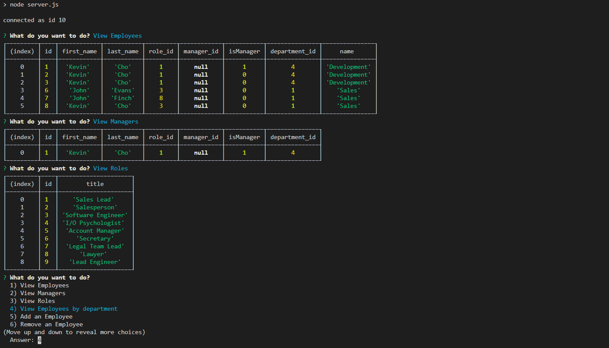

# Employee Databse CMS

This is a CLI using Node, inquirer, and MySQL, to create a writable interface which connects to a local MySQL server and performs queries. As a hypothetical business, users can view and add departments, job positions, and employees, so as to better organize the business. 

* Todo: remove/update queries

## Preview

  

## Installation

Dependencies needed for installation:

### [Node](https://nodejs.org/en/)
* npm install node
### [MySQL Workbench](https://www.mysql.com/products/workbench/)
* npm install mysql
* Run the schema from schema.sql to populate rows and columns
* Change the password field in server.js, line 18, to that of your own MySQL server instance
### [Inquirer](https://www.npmjs.com/package/inquirer)
* npm install inquirer
* Ensure dependency files are not being pushed to Github/etc. For Github, write "node_modules/" within a .gitignore file of the same parent repo. 

## Test Commands

`` node server.js
``

## Contributing
Feel free to reach out or request pulls from github. My classmates and class instructor Calvin are also to thank for helping me learn.

## License
© Kevin C Cho

Licensed under MIT License
